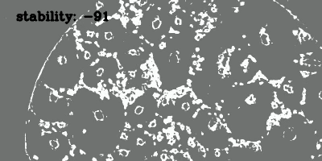

# Froth flotation videoanalytics using OpenCV

Calculates the average froth flotation bubble speed and stability

Speed calculation is based on key-points displacement over frames

Stability is based on calculating GLCM_entropy of the frames to find distinct bubbles. If bubbles blow then bunch of small bubbles appear.

Stability >100 means that bubbles blow much.
Stability < -100 mean that the flow become more occupied with big bubbles(whether it's bad or good depends on mining ore etc.)
Stability between -100 and 100 mean that the flow is stable.

``` 
python main_speed_stability.py 

```


